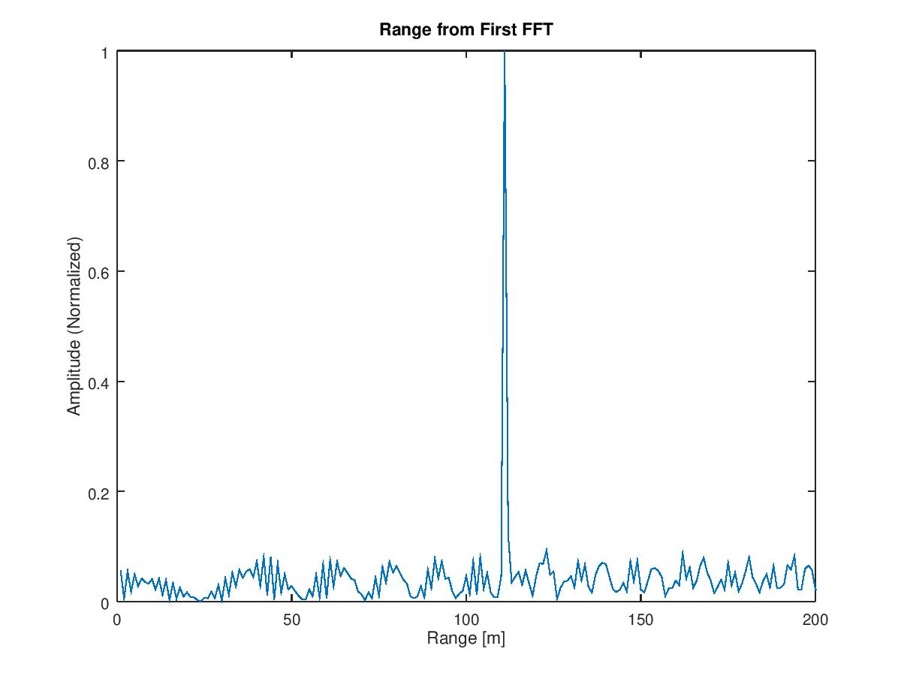
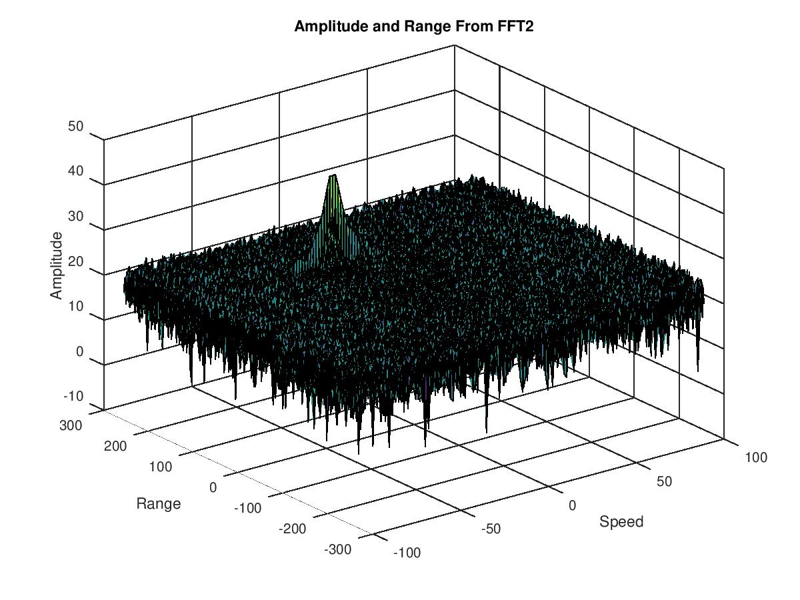
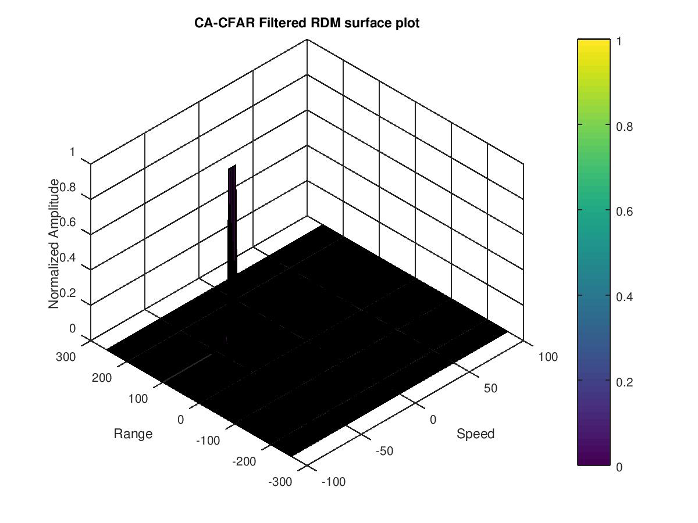

## Introduction

This project simulates a Frequency-Modulated Continuous Wave (FMCW) radar system for target detection. FMCW radar is a type of radar system that continuously transmits a signal whose frequency changes over time, typically in a sweep pattern. By analyzing the frequency difference between the transmitted and received signals, FMCW radar can determine both the range and velocity of targets.

### Key Concepts

1. FMCW Radar: A radar system that transmits continuous waves with frequency modulation, allowing for simultaneous range and velocity measurements.

2. Target Generation: In this simulation, we create a virtual target with defined initial position and velocity. This "generated" target represents an object that our simulated radar will attempt to detect.

3. Target Detection: The process of identifying the presence, range, and velocity of the target using signal processing techniques on the received radar signals.

### Project Structure

The simulation is divided into several scripts for better modularity and understanding:

1. `main.m`: The main script that runs the entire simulation by calling other modules.
2. `radar_specs.m`: Defines the radar specifications such as frequency, max range, and resolution.
3. `target_definition.m`: Sets up the target's initial position and velocity.
4. `waveform_generation.m`: Generates the FMCW waveform based on radar specifications.
5. `signal_generation.m`: Simulates the transmitted and received signals, including target movement.
6. `range_measurement.m`: Performs initial FFT for range measurement and visualization.
7. `range_doppler_response.m`: Generates and visualizes the Range-Doppler Map (RDM).
8. `cfar_implementation.m`: Implements the CA-CFAR algorithm for target detection in the RDM.

This modular structure allows for easier understanding of each step in the radar simulation process. Users can modify individual components or use them as building blocks for more complex radar simulations.

### Generated Images

The simulation generates and saves the following images:

1. `range_1st_fft.png`: Shows the range measurement from the first FFT.
2. `range_doppler_map.png`: Displays the Range-Doppler Map (RDM) generated from the 2D FFT.
3. `cfar_filtered_rdm.png`: Illustrates the CA-CFAR filtered Range-Doppler Map.

These images provide visual representations of the radar's output at different stages of processing, helping to understand the target detection process.

To run the simulation, execute the `main.m` script in MATLAB or Octave. The images will be saved in the `./images` directory.

```
octave main.m
```


## Installation

Required Packages:
  Ubuntu 22.04
  Octave 7.4.0
  Control Systems Toolbox
  Signal Processing Toolbox


```
git clone https://github.com/davidsosa/radar-target-generation-and-detection.git
```

Install Octave and Required Packages for Control and Signal Processing Toolboxes

```
sudo apt-add-repository ppa:octave/stable
sudo apt update
sudo apt-get install octave octave-control octave-signal
sudo apt install gfortran liboctave-dev libopenblas-dev
sudo apt install build-essential # Install the build-essential package
```

Inside of Octave:
```
pkg install -forge control
pkg install -forge signal
```


## Radar Specifications

```{.codeinput}
% Frequency of operation = 77GHz
% Max Range = 200m
% Range Resolution = 1 m
% Max Velocity = 100 m/s
```

## User Defined Range and Velocity of target

https://github.com/davidsosa/radar-target-generation-and-detection/blob/master/radar-target-generation-and-detection.m#L19

We define the target's initial position and velocity. Note: velocity remains constant

```{.codeinput}
range = 110
vel = -20
max_range = 200
range_res = 1
max_vel = 100 % m/s
```

## FMCW Waveform Generation
https://github.com/davidsosa/radar-target-generation-and-detection/blob/master/radar-target-generation-and-detection.m#L30

```{.codeinput}
% Design the FMCW waveform by giving the specs of each of its parameters.
% Calculate the Bandwidth (B), Chirp Time (Tchirp) and slope (slope) of the FMCW
% chirp using the requirements above.

% Operating carrier frequency of Radar
% The sweep time can be computed based on the time needed for the signal to travel the unambiguous
% maximum range. In general, for an FMCW radar system, the sweep time should be at least
% 5 to 6 times the round trip time. This example uses a factor of 5.5.

B = c / (2*range_res)
Tchirp = 5.5 * 2 * (max_range/c)
slope = B/Tchirp

% Operating carrier frequency of Radar
fc= 77e9;             % carrier freq

%The number of chirps in one sequence. Its ideal to have 2^ value for the ease of running the FFT
%for Doppler Estimation.
Nd = 128;                   % #of doppler cells OR #of sent periods % number of chirps

%The number of samples on each chirp.
Nr = 1024;                  %for length of time OR # of range cells

% Timestamp for running the displacement scenario for every sample on each
% chirp
t = linspace(0,Nd*t_chirp,Nr*Nd); %total time for samples

%Creating the vectors for Tx, Rx and Mix based on the total samples input.
Tx = zeros(1, length(t)); %transmitted signal
Rx = zeros(1, length(t)); %received signal
Mix = zeros(1, length(t)); %beat signal

%Similar vectors for range_covered and time delay.
r_t = zeros(1, length(t));
td = zeros(1, length(t));
```

## Signal generation and Moving Target simulation

https://github.com/davidsosa/radar-target-generation-and-detection/blob/master/radar-target-generation-and-detection.m#L61

Running the radar scenario over the time.

```{.codeinput}

for i=1:length(t)
  %For each time stamp update the Range of the Target for constant velocity.
  r_t(i) = range + (vel*t(i));
  td(i) = (2 * r_t(i)) / c;

  % For each time sample we need update the transmitted and
  % received signal.

  Tx(i) = cos(2*pi*(fc*t(i) + (slope*t(i)^2)/2 ) );
  Rx(i) = cos(2*pi*(fc*(t(i) -td(i)) + (slope * (t(i)-td(i))^2)/2 ) );

  %Now by mixing the Transmit and Receive generate the beat signal
  %This is done by element wise matrix multiplication of Transmit and
  %Receiver Signal

  Mix(i) = Tx(i) .* Rx(i);
end
```

## RANGE MEASUREMENT
https://github.com/davidsosa/radar-target-generation-and-detection/blob/master/radar-target-generation-and-detection.m#L82

```{.codeinput}
%reshape the vector into Nr*Nd array. Nr and Nd here would also define the size of
%Range and Doppler FFT respectively.
Mix = reshape(Mix, [Nr, Nd]);

%run the FFT on the beat signal along the range bins dimension (Nr) and
%normalize.
signal_fft = fft(Mix, Nr);

% Take the absolute value of FFT output
signal_fft = abs(signal_fft);
signal_fft = signal_fft ./ max(signal_fft); % Normalize

% Output of FFT is double sided signal, but we are interested in only one side of the spectrum.
% Hence we throw out half of the samples.
signal_fft = signal_fft(1 : Nr/2-1);

% Plotting
figure('Name', 'Range from First FFT');
plot(signal_fft);
axis([0 200 0 1]);
title('Range from First FFT');
ylabel('Amplitude (Normalized)');
xlabel('Range [m]');

% Save the figure
saveas(gcf, 'range_1st_fft.png');
```



The 2D FFT implementation is already provided here. This will run a 2DFFT on the mixed
signal (beat signal) output and generate a range doppler map.
CFAR is applied to the generated RDM


```{.codeinput}
% Range Doppler Map Generation.

% The output of the 2D FFT is an image that has reponse in the range and
% doppler FFT bins. So, it is important to convert the axis from bin sizes
% to range and doppler based on their Max values.

Mix=reshape(Mix,[Nr,Nd]);

% 2D FFT using the FFT size for both dimensions.
signal_fft2 = fft2(Mix,Nr,Nd);

% Taking just one side of signal from Range dimension.
signal_fft2 = signal_fft2(1:Nr/2,1:Nd);
signal_fft2 = fftshift (signal_fft2);

RDM = abs(signal_fft2);
RDM = 10*log10(RDM) ;

% Plotting
doppler_axis = linspace(-100, 100, Nd);
range_axis = linspace(-200, 200, Nr/2)*((Nr/2)/400);

figure('Name', 'Range Doppler Map');
surf(doppler_axis, range_axis, RDM);
title('Amplitude and Range From FFT2');
xlabel('Speed');
ylabel('Range');
zlabel('Amplitude');

% Save the figure
saveas(gcf, 'range_doppler_map.png');
```




CFAR implementation {#8}

---

```{.codeinput}
%Slide Window through the complete Range Doppler Map

%Select the number of Training Cells in both the dimensions.
n_train_cells = 10;
n_train_bands = 8;

%Select the number of Guard Cells in both dimensions around the Cell under
%test (CUT) for accurate estimation
n_guard_cells = 4;
n_guard_bands = 4;

% offset the threshold by SNR value in dB
offset = 1.4;

%Create a vector to store noise_level for each iteration on training cells
noise_level = zeros(1,1);

%design a loop such that it slides the CUT across range doppler map by
%giving margins at the edges for Training and Guard Cells.
%For every iteration sum the signal level within all the training
%cells. To sum convert the value from logarithmic to linear using db2pow
%function. Average the summed values for all of the training%cells used. After averaging convert it back to logarithimic using pow2db.
%Further add the offset to it to determine the threshold. Next, compare the
%signal under CUT with this threshold. If the CUT level > threshold assign
%it a value of 1, else equate it to 0.


% Use RDM[x,y] as the matrix from the output of 2D FFT for implementing
% CFAR

RDM = RDM / max(RDM(:));

for row0 = n_train_cells + n_guard_cells + 1 : (Nr/2) - (n_train_cells + n_guard_cells)
  for col0 = n_train_bands + n_guard_bands + 1 : (Nd) - (n_train_bands + n_guard_bands)
    %Create a vector to store noise_level for each iteration on training cells
    noise_level = zeros(1, 1);

    for row1 = row0 - (n_train_cells + n_guard_cells) : row0 + (n_train_cells + n_guard_cells)
      for col1 = col0 - (n_train_bands + n_guard_bands) : col0 + (n_train_bands + n_guard_bands)
        if (abs(row0 - row1) > n_guard_cells || abs(col0 - col1) > n_guard_bands)
          noise_level = noise_level + db2pow(RDM(row1, col1));
        end
      end
    end

    % Calculate threshold from noise average then add the offset
    thresh = pow2db(noise_level / (2 * (n_train_bands + n_guard_bands + 1) * 2 * (n_train_cells + n_guard_cells + 1) - (n_guard_cells * n_guard_bands) - 1));
    thresh = thresh + offset;

    CUT = RDM(row1,col1);

    if (CUT < thresh)
      RDM(row0, col0) = 0;
    else
      RDM(row0, col0) = 1;
    end

  end
end


%
% The process above will generate a thresholded block, which is smaller
%than the Range Doppler Map as the CUT cannot be located at the edges of
%matrix. Hence,few cells will not be thresholded. To keep the map size same
% set those values to 0.

RDM(RDM~=0 & RDM~=1) = 0;

% Plotting CFAR output
figure('Name', 'CA-CFAR Filtered RDM');
surf(doppler_axis, range_axis, RDM);
title('CA-CFAR Filtered RDM surface plot');
xlabel('Speed');
ylabel('Range');
zlabel('Normalized Amplitude');
view(315, 45);

% Save the figure
saveas(gcf, 'cfar_filtered_rdm.png');
```


