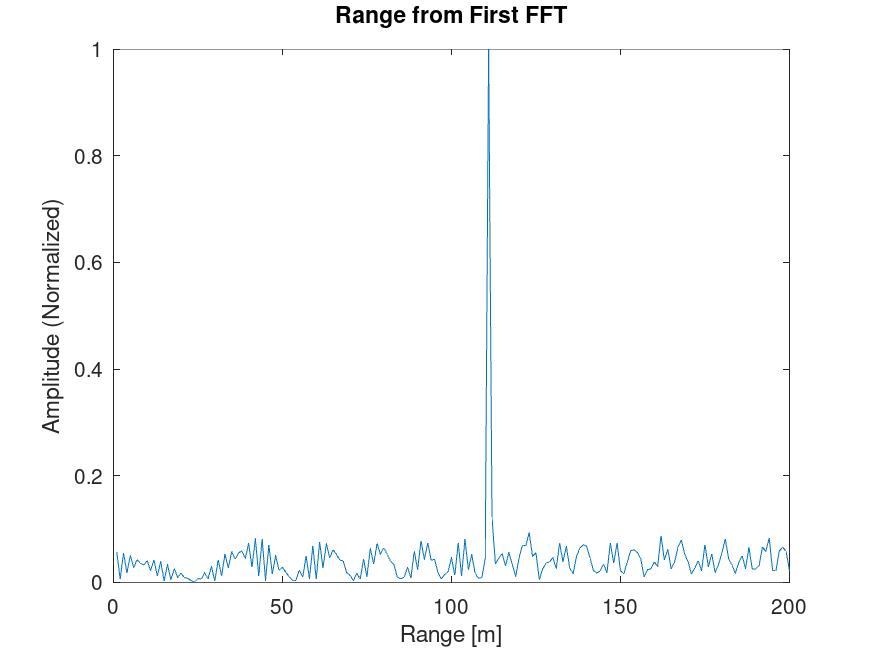

<div class="content">

## Table of Contents

<div>

- [Radar Specifications]
- [User Defined Range and Velocity of target]
- [FMCW Waveform Generation]
- [Signal generation and Moving Target simulation]
- [RANGE MEASUREMENT]
- [RANGE DOPPLER RESPONSE]
- [CFAR implementation]

</div>

## Radar Specifications

```{.codeinput}
% Frequency of operation = 77GHz
% Max Range = 200m
% Range Resolution = 1 m
% Max Velocity = 100 m/s
```

## User Defined Range and Velocity of target 

https://github.com/davidsosa/radar-target-generation-and-detection/blob/master/radar-target-generation-and-detection.m#L19

**%TODO** : define the target's initial position and velocity. Note :
Velocity remains contant

```{.codeinput}
range = 110
vel = -20
max_range = 200
range_res = 1
max_vel = 100 % m/s
```

## FMCW Waveform Generation 
https://github.com/davidsosa/radar-target-generation-and-detection/blob/master/radar-target-generation-and-detection.m#L19

```{.codeinput}
% *%TODO* :
%Design the FMCW waveform by giving the specs of each of its parameters.
% Calculate the Bandwidth (B), Chirp Time (Tchirp) and slope (slope) of the FMCW
% chirp using the requirements above.

%Operating carrier frequency of Radar
% The sweep time can be computed based on the time needed for the signal to travel the unambiguous
% maximum range. In general, for an FMCW radar system, the sweep time should be at least
% 5 to 6 times the round trip time. This example uses a factor of 5.5.

B = c / (2*range_res)
Tchirp = 5.5 * 2 * (max_range/c)  
slope = B/Tchirp

%Operating carrier frequency of Radar 
fc= 77e9;             %carrier freq

%The number of chirps in one sequence. Its ideal to have 2^ value for the ease of running the FFT
%for Doppler Estimation.
Nd = 128;                   % #of doppler cells OR #of sent periods % number of chirps

%The number of samples on each chirp.
Nr = 1024;                  %for length of time OR # of range cells

% Timestamp for running the displacement scenario for every sample on each
% chirp
t = linspace(0,Nd*t_chirp,Nr*Nd); %total time for samples

%Creating the vectors for Tx, Rx and Mix based on the total samples input.
Tx = zeros(1, length(t)); %transmitted signal
Rx = zeros(1, length(t)); %received signal
Mix = zeros(1, length(t)); %beat signal

%Similar vectors for range_covered and time delay.
r_t = zeros(1, length(t));
td = zeros(1, length(t));
```

## Signal generation and Moving Target simulation 
https://github.com/davidsosa/radar-target-generation-and-detection/blob/master/radar-target-generation-and-detection.m#L61

Running the radar scenario over the time.

```{.codeinput}

for i=1:length(t)         
  % *%TODO* 
  %For each time stamp update the Range of the Target for constant velocity. 
  r_t(i) = range + (vel*t(i));
  td(i) = (2 * r_t(i)) / c;

  % *%TODO* :
  %For each time sample we need update the transmitted and
  %received signal. 

  Tx(i)   = cos(2*pi*(fc*t(i) + (slope*t(i)^2)/2 ) );
  Rx(i)   = cos(2*pi*(fc*(t(i) -td(i)) + (slope * (t(i)-td(i))^2)/2 ) );
    
  % *%TODO* :
  %Now by mixing the Transmit and Receive generate the beat signal
  %This is done by element wise matrix multiplication of Transmit and
  %Receiver Signal

  Mix(i) = Tx(i) .* Rx(i);
end

```

## RANGE MEASUREMENT 
https://github.com/davidsosa/radar-target-generation-and-detection/blob/master/radar-target-generation-and-detection.m#L82


**%TODO** :

```{.codeinput}
%reshape the vector into Nr*Nd array. Nr and Nd here would also define the size of
%Range and Doppler FFT respectively.
Mix = reshape(Mix, [Nr, Nd]);

 % *%TODO* :
%run the FFT on the beat signal along the range bins dimension (Nr) and
%normalize.
signal_fft = fft(Mix, Nr);

 % *%TODO* :
% Take the absolute value of FFT output
signal_fft = abs(signal_fft);
signal_fft = signal_fft ./ max(signal_fft); % Normalize

 % *%TODO* :
% Output of FFT is double sided signal, but we are interested in only one side of the spectrum.
% Hence we throw out half of the samples.
signal_fft = signal_fft(1 : Nr/2-1);

plotting the range
figure ('Name','Range from First FFT')

 % *%TODO* :
% plot FFT output 
plot(signal_fft);
axis ([0 180 0 1]);
title('Range from First FFT');
ylabel('Amplitude (Normalized)');
xlabel('Range [m]');
axis ([0 200 0 1]);

```



